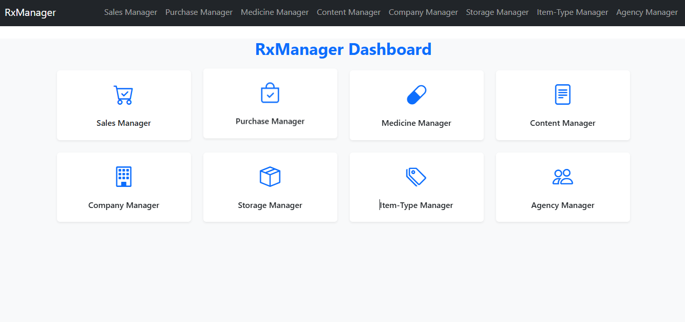
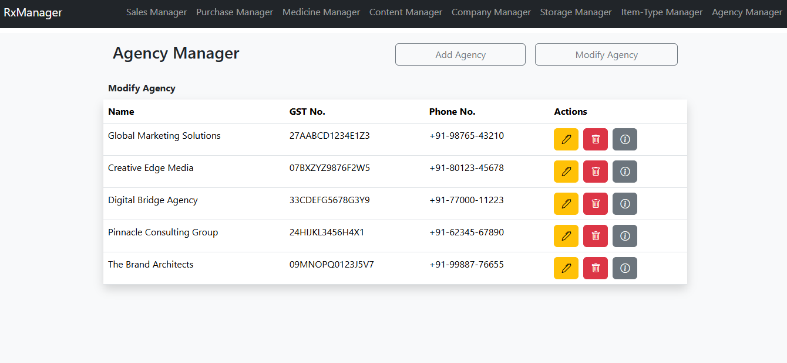
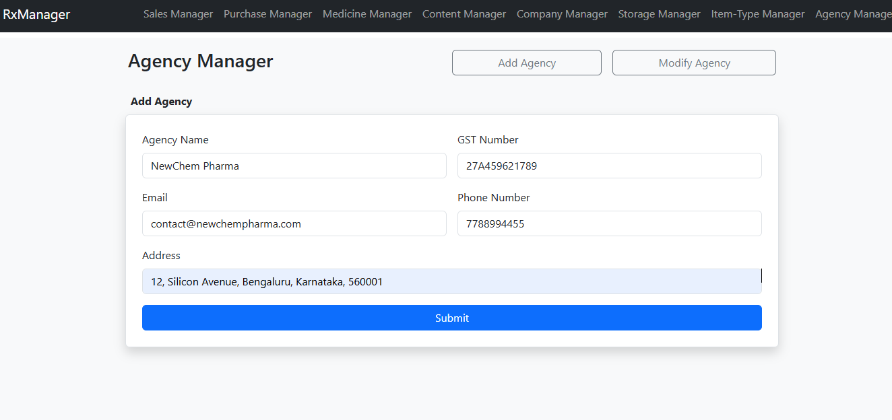
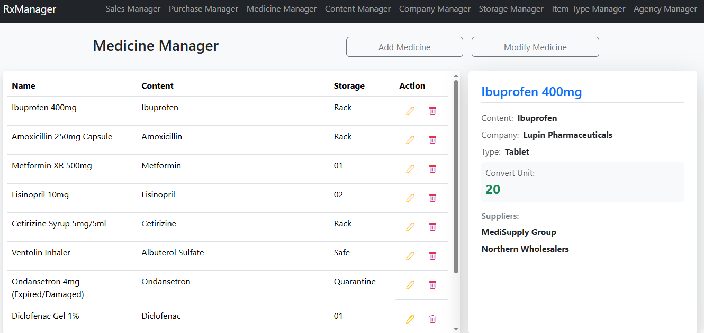
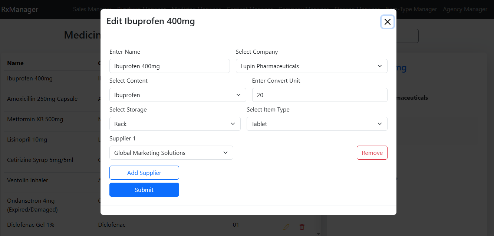
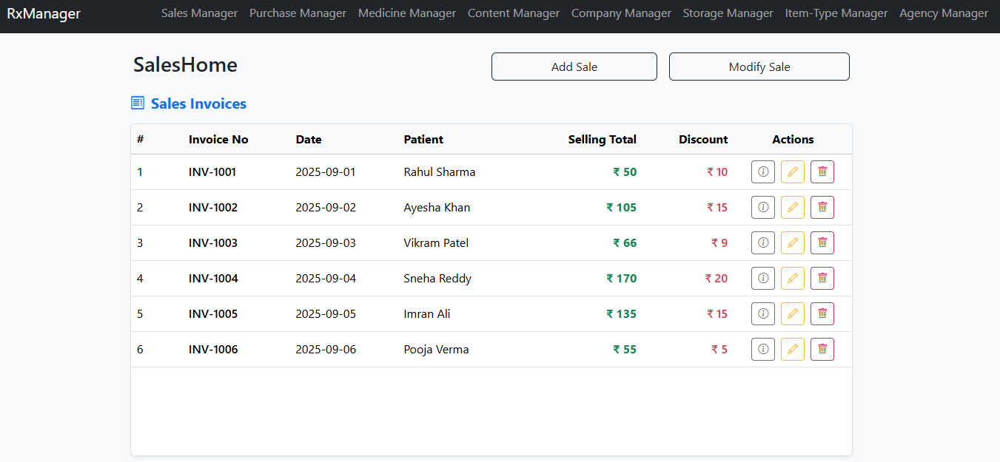

# RxManager 💊

**RxManager** is a full-stack pharmacy/store management system designed to manage **sales, purchases, stock, and storage** efficiently.  
The application helps shop owners keep track of medicines, inventory levels, and transactions in a structured and reliable way.

Built using **Node.js, Express, MongoDB** for the backend and **React** for the frontend.

---

## 🚀 Features

- 📦 Medicine / Product management (CRUD)
- 🏪 Storage & stock management
- 🧾 Sales management
- 📥 Purchase management
- 📊 Automatic stock updates on sales & purchases
- 🔍 Search and filter medicines
- 🖥️ Clean and responsive UI

---

## 🛠️ Tech Stack

### Frontend
- React
- JavaScript
- HTML5, CSS3
- Axios (API communication)

### Backend
- Node.js
- Express.js
- MongoDB
- Mongoose

---

## 📸 Screenshots


| | |
|---|---|
|  |  |
|  |  |
|  |  |


---

## 📂 Project Structure

```bash
RxManager/
├── backend/
│   ├── models/
│   ├── routes/
│   ├── controllers/
│   ├── middleware/
│   └── server.js
│
├── frontend/
│   ├── src/
│   ├── components/
│   ├── pages/
│   └── services/
│
├── screenshots/
│   ├── rx1.PNG
│   ├── rx2.PNG
│   ├── rx3.PNG
│   ├── rx4.PNG
│   ├── rx5.PNG
│   └── rx6.PNG
│
└── README.md

